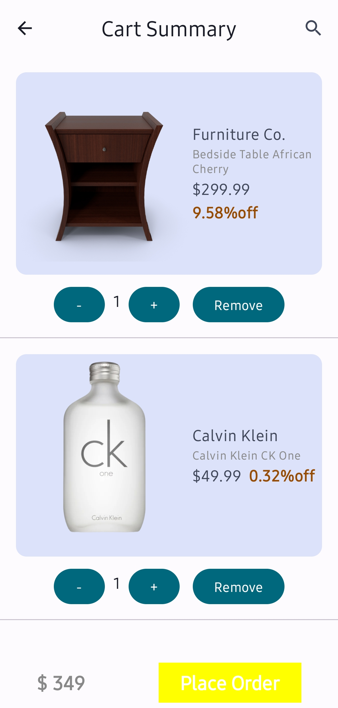

# 🛍️ MyShopApp - E-Commerce Android App

**MyShopApp** is a modern e-commerce Android application built using **Jetpack Compose**, **Firebase Firestore**, and **Retrofit**. 
It provides a seamless shopping experience with user authentication, product listings, and clean UI.

---

## ✨ Features

- 🔐 **User Authentication** (Email/Google Sign-in via Firebase)
- 🛒 **Product Listings** with dynamic updates
- 🛍️ **Cart & Checkout** functionality
- 🔍 **Search** for easy navigation
- 🌙 **Dark Mode Support**
- 📸 **Image Loading with Coil**
- 🚀 **Jetpack Compose for Fast & Responsive UI**
- 🔥 **Dependency Injection using Hilt & Dagger**
- 📡 **REST API Integration with Retrofit**

---

## 🛠️ Tech Stack

| **Technology**  | **Purpose** |
|---------------|------------|
| **Jetpack Compose**  | UI & Layouts  |
| **Firebase Firestore**  | Database & Backend |
| **Firebase Authentication** | User Login & Signup |
| **Retrofit**  | API Calls |
| **Coil**  | Image Loading |
| **Hilt & Dagger**  | Dependency Injection |

---

## 🚀 Installation Guide  

### **Prerequisites**  
Before setting up the project, ensure you have:  
- ✅ **Android Studio** (latest version)  
- ✅ **JDK 11 or higher**  
- ✅ **Gradle** (handled by Android Studio)  
- ✅ **Firebase Project** (Firestore & Authentication enabled)  
- ✅ **A Physical Device / Emulator** (API Level 24 or above)  

---

### **🔹 1. Clone the Repository**  
Open a terminal and run:  
```bash
git clone https://github.com/mrYassh/MyShopApp.git
cd MyShopApp

## 📸 Screenshots

### About Us


### Address Page


### Create Account


### Homepage


### Login


### My Cart


### My Orders


### Order Summary


### Payment


### Product Description


### Product Page


### Search


### Side Drawer

